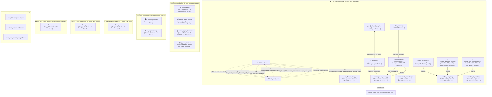

```mermaid
flowchart TD
    subgraph Sub_controller["🎮 TẦNG ĐIỀU KHIỂN & TELEMETRY (controller/)"]
        controller_topology_config_json["⚙️ topology_config.json"]
        controller_traffic_config_json["⚙️ traffic_config.json"]
        controller_ebpf_telemetry_c["⚡ ebpf_telemetry.c<br/><i>(eBPF/XDP Kernel C)</i>"]
        controller_analyze_and_label_dataset["⚡ analyze_and_label_dataset.py<br/><i>(Script Phân tích Phân vị & Chốt Ngưỡng Ground...)</i>"]
        controller_controller["⚡ controller.py<br/><i>(Ryu Controller OpenFlow 1.3 chuyên dụng cho M...)</i>"]
        controller_dcn_flow_engine["⚡ dcn_flow_engine.py<br/><i>(Công cụ sinh và tiếp nhận luồng TCP chính xác...)</i>"]
        controller_ebpf_loader["⚡ ebpf_loader.py<br/><i>(ebpf_loader.py - Userspace eBPF / XDP Loader ...)</i>"]
        controller_management_plane["⚡ management_plane.py<br/><i>(Tầng Quản trị & Telemetry Toàn Diện (Comprehe...)</i>"]
        controller_microburst_generator["⚡ microburst_generator.py<br/><i>(Module sinh tải Heavy Jitter / Ephemeral Micr...)</i>"]
        controller_spine_leaf_topo["⚡ spine_leaf_topo.py<br/><i>(Topology Multi-tier Spine-Leaf chạy hoàn toàn...)</i>"]
        controller_traffic_generator["⚡ traffic_generator.py<br/><i>(Bộ sinh lưu lượng nền thống nhất cho mạng Dat...)</i>"]
        controller_unified_sampler["⚡ unified_sampler.py<br/><i>(Module toán học lấy mẫu ngẫu nhiên từ Hồ sơ p...)</i>"]
        controller_validate_workload_kstest["⚡ validate_workload_kstest.py<br/><i>(Kiểm định Thống kê Học thuật Kolmogorov-Smirn...)</i>"]
        controller_visualize_all_results["⚡ visualize_all_results.py<br/><i>(Sinh toàn bộ hệ thống biểu đồ trực quan hóa d...)</i>"]
    end

    subgraph Sub_controller_supply["📦 CÔNG CỤ XỬ LÝ & BỔ TRỢ (controller/supply/)"]
        controller_supply_blend_cdfs["📦 blend_cdfs.py<br/><i>(Hòa trộn toán học 9 file phân phối thực nghiệ...)</i>"]
        controller_supply_digitize_paper_plots["📦 digitize_paper_plots.py<br/><i>(Số hóa tự động chính xác tuyệt đối 9 đường co...)</i>"]
        controller_supply_extract_paper_figures["📦 extract_paper_figures.py<br/><i>(Trích xuất các biểu đồ ECDF thực nghiệm từ fi...)</i>"]
        controller_supply_tcp_flow_server["📦 tcp_flow_server.py<br/><i>(Multi-threaded TCP Flow Sink Server siêu nhẹ ...)</i>"]
    end

    subgraph Sub_ml_engine["🧠 TẦNG HỌC MÁY & DRL ROUTING (ml_engine/)"]
        ml_engine_classifier_planned["⏳ ml_engine/classifier/<br/><i>(Đang phát triển theo Kế hoạch)</i>"]
        ml_engine_routing_planned["⏳ ml_engine/routing/<br/><i>(Đang phát triển theo Kế hoạch)</i>"]
    end

    subgraph Sub_nfv_proxy["🧩 ỨNG DỤNG NHÚNG NFV PROXY (nfv_proxy/)"]
        nfv_proxy_planned["⏳ nfv_proxy/<br/><i>(Đang phát triển theo Kế hoạch)</i>"]
    end

    subgraph Sub_data_plane["⚡ MẶT PHẲNG DỮ LIỆU & HẠ TẦNG (data_plane/)"]
        data_plane_planned["⏳ data_plane/<br/><i>(Đang phát triển theo Kế hoạch)</i>"]
    end

    subgraph Sub_evaluate["📊 ĐỐI SÁNH HIỆU NĂNG & BENCHMARK (evaluate/)"]
        evaluate_planned["⏳ evaluate/<br/><i>(Đang phát triển theo Kế hoạch)</i>"]
    end

    subgraph Sub_results["📈 DATASETS & TELEMETRY OUTPUT (results/)"]
        results_2026_10_17_22_22_link_utilization_telemetry_csv["📈 link_utilization_telemetry.csv"]
        results_2026_10_17_22_22_network_evaluation_kpis_csv["📈 network_evaluation_kpis.csv"]
        results_2026_10_17_22_22_traffic_flow_dataset_with_paths_csv["📈 traffic_flow_dataset_with_paths.csv"]
    end

    controller_management_plane -->|imports| controller_ebpf_loader
    controller_traffic_generator -->|imports| controller_unified_sampler
    controller_validate_workload_kstest -->|imports| controller_unified_sampler
    controller_analyze_and_label_dataset -->|imports| controller_unified_sampler
    controller_topology_config_json -.->|ref: /ecn_settings/enabled| controller_traffic_config_json
    controller_topology_config_json -.->|ref: /ecn_settings/marking_threshold_k_bytes| controller_traffic_config_json
    controller_topology_config_json -.->|ref: /ecn_settings/limit_bytes| controller_traffic_config_json
    controller_traffic_config_json -.->|ref: /links/bandwidth_mbps/access_host| controller_topology_config_json
    controller_traffic_config_json -.->|ref: /system_info/hardware_reference/server_nic_speed_mbps| controller_topology_config_json
    controller_traffic_config_json -.->|ref: /hosts/resources/cpus| controller_topology_config_json
    controller_traffic_config_json -.->|ref: /system_info/hardware_reference/server_physical_cores| controller_topology_config_json
    controller_spine_leaf_topo <-->|OpenFlow 1.3 TCP:6653| controller_controller
    controller_controller <-->|Ryu REST API / Stats| controller_management_plane
    controller_ebpf_telemetry_c -->|Compiled & Loaded| controller_ebpf_loader
    controller_ebpf_loader -->|Ring Buffer Events| controller_management_plane
    controller_management_plane -->|Ghi log luồng| results_traffic_flow_dataset_with_paths_csv
```